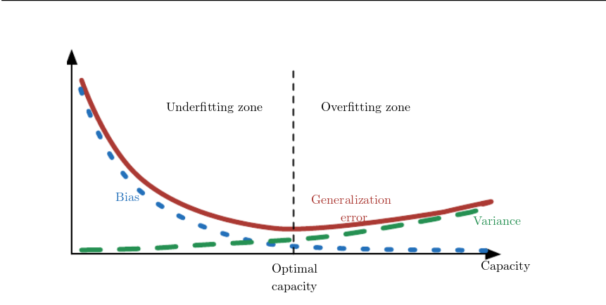

# 数据科学, 机器学习面试

## 目录

[解释机器学习中的偏差和方差，并提出解决他们带来的问题的方法.](#解释机器学习中的偏差和方差，并提出解决他们带来的问题的方法)
[机器学习中的偏差-方差权衡是什么?](#机器学习中的偏差-方差权衡是什么)
[什么是梯度下降?](#什么是梯度下降)
[假设检验的一般步骤.](#假设检验的一般步骤)

## 正文

### 解释机器学习中的偏差和方差，并提出解决他们带来的问题的方法

`偏差`度量了学习算法的期望预测与真实结果的偏离程度, 即刻画了学习算法本身的拟合能力; `方差`度量了同样大小的训练集的变动所导致的学习性能的变化, 即刻画了数据扰动所造成的影响( ;`噪声`表达了在当前任务上任何学习算法所能达到的期望泛化误差的下界, 即刻画了学习问题本身的难度). (西瓜书 2.5)

`Bias` measures the expected deviation from the true value of the function or parameter. `Variance` on the other hand, provides a measure of the deviation from the expected estimator value that any particular sampling of the data is likely to cause. (deeplearningbook 5.4.4)

`Low Bias`: Suggests less assumptions about the form of the target function.
`High Bias`: Suggests more assumptions about the form of the target function.
`Low Variance`: Suggests small changes to the estimate of the target function with changes to the training dataset.
`High Variance`: Suggests large changes to the estimate of the target function with changes to the training dataset. [引用出处](https://machinelearningmastery.com/gentle-introduction-to-the-bias-variance-trade-off-in-machine-learning/)

### 机器学习中的偏差-方差权衡是什么

偏差-方差权衡是机器学习模型的一个属性, 它来源于偏差与方差的冲突: 减小偏差会增大方差, 减小方差会增大偏差, 无法同时减小二者. [归纳自维基百科](https://en.wikipedia.org/wiki/Bias%E2%80%93variance_tradeoff)

泛化性能由学习算法的能力, 数据的充分性以及学习任务本身的难度共同决定. 给定学习任务, 为了取得好的泛化性能, 需要使偏差较小, 即能够充分拟合数据, 并使方差较小, 即使得数据扰动产生的影响小. 一般来说, 偏差和方差是冲突的. 训练不足时, 学习器的拟合能力不够, 训练数据的扰动不足以使学习器产生显著变化, 此时偏差主导了泛化错误率; 随着训练程度的加深, 学习器的拟合能力逐渐增强, 训练数据发生的扰动渐渐能被学习器学到, 方差逐渐主导了泛化错误率; 在训练程度充足后, 学习器的拟合能力已经非常强, 训练数据发生的轻微扰动都会导致学习器发生显著变化, 若训练数据本身, 非全局的特性被学习器学到了, 则将发生过拟合. (西瓜书 2.5)

<small>[deeplearningbook Figure5.6](https://www.deeplearningbook.org/contents/ml.html)</small>

The most common way to negotiate this trade-off is to use **cross-validation**. Alternatively, we can compare the **mean squared error(MSE)** of the estimates: The MSE measures the overall expected deviation between the estimator and the true value of the parameter $\theta$. Evaluating the MSE incorporates both the bias and the variance. Desirable estimators are those with small MSE error and these are estimators that manage to keep both their bias and variance somewhat in check. (deeplearningbook 5.4.4)

判断偏差-方差权衡最常用的方法是**交叉验证**. 另外, 也可以比较这些估计的**均方误差 MSE**, 它度量了估计和真实参数$\theta$之间的平方误差的总体期望偏差. MSE 估计包含了偏差和方差, 理想的估计具有较小的 MSE, 或者在检查中会稍微约束它们的偏差和方差. (深度学习 5.4.4)

### 什么是梯度下降

大多数深度学习算法都涉及某种形式的优化. **优化**指的是, 改变 x 以最大化或最小化某个函数 $f(x)$ 的任务. 将要最大化或最小化的函数称为**目标函数**, 或者**准则 criterion**. 当对其进行最小化时, 也把它称为**代价函数**, **损失函数**或**误差函数**. 利用损失函数的**导数**来指导参数更新, 实现最小化函数的技术就称为**梯度下降 gradient descent**. 导数代表 $f(x)$ 在点 x 处的斜率, 它表明如何缩放输入的小变化才能在输出获得相应的变化. 梯度下降利用了这一特点, 将 x 往导数的反方向移动一小步来减小 $f(x)$. 对于多维输入的函数 (输入向量), 梯度是相对于一个向量求导的导数, 是包含所有偏导数的向量. (汇总自深度学习 4.3)

### 假设检验的一般步骤

> **统计假设检验 (hypothesis test)** 为进行学习器性能比较提供了重要依据. 基于假设检验结果可以推断出, 若在测试集上观察到学习器 A 比 B 好, 则 A 的泛化性能是否在统计意义上优于 B, 以及这个结论的把握有多大. (西瓜书 2.4)

假设检验的一般步骤如下 [维基百科](https://en.wikipedia.org/wiki/Statistical_hypothesis_testing):

1. 研究之初, 假设真相不明;
2. 提出相关的**零假设 null hypothesis**和**备择假设 alternative hypothesis**;
3. 考虑检验中对样本作出的**统计假设 statistical assumptions**, 比如独立性假设 (#???, 不太懂是什么意思);
4. 决定哪个检验是合适的, 并确定相关的**检验统计量 test statistic**;
5. 在零假设下推导检验统计量的分布. 在标准情况下, 应得到一个熟知的结果, 比如检验统计量可能符合正态分布;
6. 选择一个显著性水平, 若低于这个阈值, 就会拒绝零假设, 常用的是 5% 和 1%;
7. 根据在零假设成立时的检验统计量分布, 找到数值最接近备择假设, 且机率为显著性水平的区域 (**拒绝域 critical region**);
8. 针对检验统计量, 根据样本计算其估计值;
9. 若估计值未落在拒绝域, 接受零假设, 否则拒绝零假设.

维基百科上另一种更简短的过程:

1. (提出零假设;)
2. 基于观测, 计算出检验统计量的观测值;
3. 计算 **p值**;
4. 若 p值小于显著性水平, 拒绝零假设, 接受备择假设.

> 对于给定的统计模型, **p值 p-value (probability value)** 是零假设成立的的概率. [维基百科](https://en.wikipedia.org/wiki/P-value)

### LSTM/GRU 如何缓解梯度消失或爆炸

- LSTM/GRU, 通过门控, 动态地调整每个时间步的连接权.
- LSTM 引入了自循环 (从cell 到 cell?), 以产生梯度长时间持续流动的路径, 缓解了梯度消失和爆炸问题. 通过门控, 自循环的权可以动态地调整.

### 如何理解 ROC 和 AUC

- ROC, Receiver operating characteristic, 受试者工作特征, 纵轴是真正率, 横轴是假正率.
- 进行模型比较时, 若一个模型的 ROC 被另一个的完全包住, 可以断言后者的性能优于前者; 若 ROC 曲线存在交叉, 一般难以判断两者的优劣. AUC 是此情况下较为合理的判据.

### 查全率和查准率如何计算

- recall = TP/(TP+FN)   # 假反例, 也就是正例被误判为反例, 于是分母就构成了正例的总数, 这也正是翻译查全率的由来, 要尽可能多地将正例揪出来
- precision = TP/(TP+FP)  # 被预测为正例的样本中, 真正例的比例. (可以记成, 混淆矩阵的第一列)
- F1 = 2/(recall^{-1}+precision^{-1})=2\*(precision\*recall)/(precision+recall)

### Bagging 和 Boosting 的区别

1. 样本选择上：
  - Baggin ：训练集是在原始集中有放回选取的，从原始集中选出的各轮训练集之间是独立的。
  - Boostin ：每一轮的训练集不变，只是训练集中每个样例在分类器中的权重发生变化。而权值是根据上一轮的分类结果进行调整。
2. 样例权重：
  - Baggin ：使用均匀取样，每个样例的权重相等
  - Boostin ：根据错误率不断调整样例的权值，错误率越大则权重越大。
3. 预测函数：
  - Baggin ：所有预测函数的权重相等。
  - Boostin ：每个弱分类器都有相应的权重，对于分类误差小的分类器会有更大的权重。
4. 并行计算：
  - Baggin ：各个预测函数可以并行生成
  - Boostin ：各个预测函数只能顺序生成，因为后一个模型参数需要前一轮模型的结果。

### LDA

- LDA 是一种主题模型，它可以将文档集中每篇文档的主题按照概率分布的形式给出，对于每一个主题均可找出一些词语来描述它。
- 每个主题都表示为词汇的dirichlet(狄利克雷)分布
- 每个文档都表示为主题的dirichlet分布
- 求解LDA模型常用Gibbs(吉布斯)采样

### K-means vs KNN

- KNN 是一种用于分类和回归的无参数模型, 属于监督学习方法!!!
  - 在k-NN分类中，输出是一个分类族群。一个对象的分类是由其邻居的“多数表决”确定的，k个最近邻居（k为正整数，通常较小）中最常见的分类决定了赋予该对象的类别。若k = 1，则该对象的类别直接由最近的一个节点赋予。
  - 在k-NN回归中，输出是该对象的属性值。该值是其k个最近邻居的值的平均值。
- k-means 是一个聚类算法, 属于无监督学习方法. 它把样本划分到k个聚类中，使得每个点都属于离他最近的均值（此即聚类中心）对应的聚类，以之作为聚类的标准。

### 独立变量之间的期望方差计算

- E(XY)=E(X)E(Y), 独立变量的乘积的期望=期望的乘积
- E(X+Y)=E(X)+E(Y), 独立变量的和的期望=期望的和
- D(X+Y)=D(X)+D(Y), 独立变量的和的方差=方差的和

### 常见的决策树算法, 及其特点

- 特征选择的标准，有信息增益和基尼系数两种
- `CART` 以基尼系数选择切分特征, 运行速度一般, 后剪枝, 支持缺失值处理
- `ID3` 以信息增益选择切分特征, 运行速度慢, 不支持剪枝, 不支持缺失值处理
- `C4.5` 以信息增益率选择切分特征, 运行速度快于 ID3, 预剪枝, 不支持缺失值处理
- `C5.0` 以信息增益率选择切分特征, 运行速度最快, 预剪枝, 支持缺失值处理
- (信息增益对可取数目较多的属性有所偏好。 增益率对可取数目较少的属性有所偏好。 )

### 激活函数的作用

- 神经元的工作, 简单地说, 就是计算了输入的加权和, 再加上一个偏置. 不带激活函数的情况下, 一个神经网络层就是对输入进行了线性变换, 网络的表达能力不够, 不能解决非线性问题, 比如经典的 XOR 问题. 因此引入了非线性激活函数, 提高神经网络模型的表达能力, 解决线性模型不能解决的问题.
- 对于 CNN 而言, 激活函数加在卷积层之后, PyTorch 实现的 ResNet, 实际上在卷积和激活函数之间还有一层 BN 层, 然后才是激活函数之后的池化层.

### Max pooling 的梯度如何反向传播

- 非最大值单元的梯度都为 0 , 梯度只沿着最大值反向传播. 一个直观的理解是, 只要不是最大值, 它们再怎么闹, 对结果都没有影响, 也就不必调整它们对应的路径上的参数了.

### Logistic Regression 的损失函数

- 

### Dropout 的形式以及作用

- Dropout, 在训练阶段, 每个神经元以概率 p 失活, 连通着它的入边和出边也都被丢弃了. (不同于 DropConnection, 只是丢弃了神经元的部分入边)
- 训练阶段, 神经元以概率 p 被丢弃; 预测阶段, 不丢弃神经元, 但是它们的输出会相应地减少 p. 还有一种做法是反过来, 训练时, 以概率 p 丢弃神经元后, 未丢弃的神经元的输出放大 1-p 倍, 此时, 预测阶段, 神经元的输出不变.
- 通过每次迭代随机地丢弃神经元, Dropout 能减轻神经元之间的相互依赖, 从而有效地防止过拟合.
- Dropout 能鼓励神经网络学习到更加鲁棒的特征, 这些特征对 dropout 后的子神经网络都有用.
- 对一个具有 H 个神经元的神经网络, 每个神经元都可以保留或者丢弃, 所以理论上可以有 2^H 个子网络.

### SVM 和 LR 的异同

- 共同点:
    - LR 和 SVM 都能用于分类
    - 如果不考虑核函数, LR 和 SVM 都是线性分类器, 即它们的分类决策面都是线性的
    - LR 和 SVM 都是监督学习方法
    - LR 和 SVM 都是判别模型, 计算条件概率分布 P(Y|X), 即它们不关心数据是如何产生的, 只关心数据之间的差别, 用差别来进行分类
        - 常见的判别式模型: KNN, SVM, LR
        - 常见的生成式模型: 朴素贝叶斯, 隐马尔可夫模型

    - LR 和 SVM 都不复杂, 在学术界和工业界都广为认知, 并得到了广泛应用
- 不同点
    - 本质的不同是: 损失函数不同. 逻辑回归基于概率论, 假设样本为 1 的概率可以用 sigmoid 函数表示, 通过极大似然估计的方式估计出参数值; 支持向量机基于`几何间隔最大化原理`, 认为存在最大几何间隔的分类面为最优分类面.
    - SVM 只考虑局部的边界线附近的点, 而 LR 考虑全局数据. 换言之, 影响 SVM 决策面的样本只有少数的支持向量, 而 lR 中, 每个样本都对决策面有影响. 所以 SVM 不直接依赖于数据分布, LR 则受所有数据的影响.
    - 在解决非线性问题时, SVM 采用核函数机制, LR 则不采用核函数的方法. 由于 SVM 只有少数支持向量影响决策面, 因此只有少数样本参与核计算; 而 LR 中每个样本都参与决策面的计算, 如果也使用核函数, 每个样本都参与核计算, 计算复杂度高.
    - 线性 SVM 依赖数据表达的距离测度, 需要先对数据做 normalization, 而 LR 不受影响.
    - SVM 的损失函数自带正则, 所以 SVM 是结构风险最小的算法的原因, LR 需要另外添加正则项.

### Normalization 和 Standardization 的区别

- Normalization 的处理通常是: 减去最小值再除以区别长度, 将数据缩放到 [0, 1] 的区间内
- Standardization 的处理是, 减去均值再除以标准差, 将数据缩放成服从以 0 为均值, 1 为标准差的正太分布
- 归一化不改变数据的分布; 标准化会改变数据的分布
- 归一化是一种简化计算, 通常用于将有量纲的表达式转化成无量纲的表达式, 变成纯量, 消除量纲对模型的影响, 使不同变量具有可比性
- 标准化能将狭长的数据分布转变成类圆型的, 使不同特征对目标函数的影响权重一致, 能够加快模型收敛, 同时提高解的精度.

### RF, GBDT, XGBoost 的异同

- RF、GBDT和XGBoost都属于集成学习，目的是通过结合多个基学习器的预测结果来改善单个学习器的泛化能力和鲁棒性。
- 根据个体学习器的生成方式，目前的集成学习方法大致分为两大类：即个体学习器之间存在强依赖关系、必须串行生成的序列化方法，以及个体学习器间不存在强依赖关系、可同时生成的并行化方法；前者的代表就是Boosting，后者的代表是Bagging和“随机森林”。(西瓜书, P173)
- Bagging 使用有放回地抽样, 得到 T 个 m 个样本(可能存在重复)的采样集, 基于每个采样集训练一个基学习器, 再将基学习器进行组合. 对于分类, 使用简单投票法; 对于回归, 使用简单平均法
- RF 是 bagging 的扩展变态, 在以决策树为基学习器构建 bagging 集成的基础上, 进一步在决策树的训练过程中引入了随机属性选择. 概括地讲, RF 包括四部份: 1) 随机采样 (有放回); 2) 随机特征选择 (对基决策树的每个节点, 先从节点的属性集合中随机选择一个包含 k 个属性的子集, 再从子集中选择一个最优属性用于划分); 3) 构建决策树; 4) 随机森林投票
- RF和Bagging对比：RF的起始性能较差，特别当只有一个基学习器时，随着学习器数目增多，随机森林通常会收敛到更低的泛化误差。随机森林的训练效率也会高于Bagging，因为在单个决策树的构建中，Bagging使用的是‘确定性’决策树，在选择特征划分结点时，要对所有的特征进行考虑，而随机森林使用的‘随机型’决策树则只考察一个属性子集. (西瓜书, P181)
- Boosting 中, 不同的分类器是通过串行训练而获得的，每个新分类器都根据已训练的分类器的性能来进行训练, 通过关注被已有分类器错分的那些数据来获得新的分类器。
- Bagging中的分类器权值是一样的，而Boosting中的分类器权重并不相等，每个权重代表对应的分类器在上一轮迭代中的成功度。
- GradientBoost与传统的Boosting区别较大，前者的每一次计算都是为了减少上一次的残差，在残差减小的梯度方向上建立模型,后者则关注正确错误的样本加权。 
- GBDT(Gradient Boosted Decision Trees)会累加所有树的结果，而这种累加是无法通过分类完成的，因此GBDT的树都是CART回归树，而不是分类树（尽管GBDT调整后也可以用于分类但不代表GBDT的树为分类树）.
- GBDT 与 XGBoos 的区别
    1. 传统GBDT以CART作为`基分类器`，xgboost还支持线性分类器，这个时候xgboost相当于带L1和L2正则化项的逻辑斯蒂回归（分类问题）或者线性回归（回归问题）。
    2. 传统GBDT在优化时只用到一阶`导数信息`，xgboost则对代价函数进行了二阶泰勒展开，同时用到了一阶和二阶导数。顺便提一下，xgboost工具支持自定义代价函数，只要函数可一阶和二阶求导。
    3. xgboost在代价函数里加入了`正则项`，用于控制模型的复杂度。正则项里包含了树的叶子节点个数、每个叶子节点上输出的score的L2模的平方和。从Bias-variance tradeoff角度来讲，正则项降低了模型的variance，使学习出来的模型更加简单，防止过拟合，这也是xgboost优于传统GBDT的一个特性。
    4. `Shrinkage（缩减）`，相当于学习速率（xgboost中的eta）。xgboost在进行完一次迭代后，会将叶子节点的权重乘上该系数，主要是为了削弱每棵树的影响，让后面有更大的学习空间。实际应用中，一般把eta设置得小一点，然后迭代次数设置得大一点。（补充：传统GBDT的实现也有学习速率）
    5. `列抽样（column subsampling）`。xgboost借鉴了随机森林的做法，支持列抽样，不仅能降低过拟合，还能减少计算，这也是xgboost异于传统gbdt的一个特性。
    6. `对缺失值的处理`。对于特征的值有缺失的样本，xgboost可以自动学习出它的分裂方向。
    7. xgboost工具支持`并行`。boosting不是一种串行的结构吗?怎么并行的？注意xgboost的并行不是tree粒度的并行，xgboost也是一次迭代完才能进行下一次迭代的（第t次迭代的代价函数里包含了前面t-1次迭代的预测值）。xgboost的并行是在特征粒度上的。我们知道，决策树的学习最耗时的一个步骤就是对特征的值进行排序（因为要确定最佳分割点），xgboost在训练之前，预先对数据进行了排序，然后保存为block结构，后面的迭代中重复地使用这个结构，大大减小计算量。这个block结构也使得并行成为了可能，在进行节点的分裂时，需要计算每个特征的增益，最终选增益最大的那个特征去做分裂，那么各个特征的增益计算就可以开多线程进行。
    8. `可并行的近似直方图算法`。树节点在进行分裂时，我们需要计算每个特征的每个分割点对应的增益，即用贪心法枚举所有可能的分割点。当数据无法一次载入内存或者在分布式情况下，贪心算法效率就会变得很低，所以xgboost还提出了一种可并行的近似直方图算法，用于高效地生成候选的分割点。

